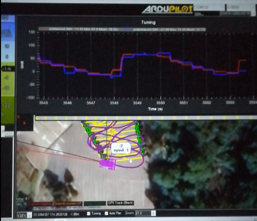
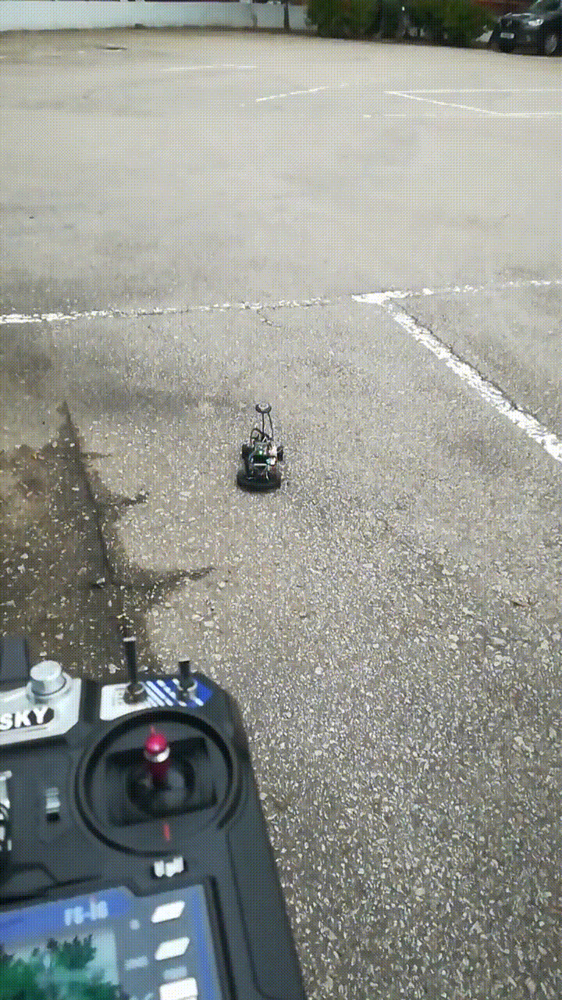

# :tractor: GPS Waypoint Follower

I used the flight [controller](https://docs.px4.io/main/en/flight_controller/pixhawk4.html) from my crashed drone and put it on the rc-car won from the [autonomous rc-car race](../autonomous_rc-car_race/autonomous_rc-car_race.md). And boom I got an autonomous rover that can follow gps coordinates set up in [Ardupilot](https://ardupilot.org/ardupilot/index.html) as the mission planner.

<!-- more -->

{ width="250" }
## :pencil: My takeaways:

- GPS coordinates are not very accurate and deviate several meters. For driving on a parking lot the mission sometimes shifts up to 3m away. So for more precises movement an expensive RTK GPS would be needed.
- Working on outdoor robots is very cumbersome because I needed to go to an specific place for development and will be interrupted by coming cars, people or the bad weather. Also it is very hot most of the time :sweat_drops:
- Learned how to tune the PID so that the car will go to the goal position without too much overshoot.
