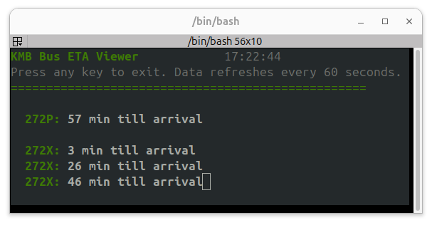

# :oncoming_bus: KMB Bus TUI

When at work, I wanted a quick way to check the next bus arrivals without opening my phone or a web browser. So, I created a terminal user interface (TUI) application that fetches real-time bus arrival data from the KMB API and displays it in a simple and efficient manner.

<!-- more -->

:link: Link to the [Github project](https://github.com/JosefGst/KMB_Bus_TUI) .
