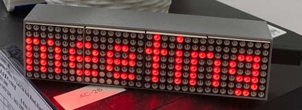

# :pager: Display WhatsApp messages on a LED matrix with ESP32

Do you need a small and cheap display to show about your status? Like you're in a meeting, on site or on holiday? With this project you can conveniently send a Whatsapp message to twilio, **NO extra mobile App** is required and the message will show up on the LED matrix.

<!-- more -->

## :nut_and_bolt: Hardware Requirements:

To get started with this project, you'll need the following hardware components:

- ESP32 board (e.g., ESP32 DevKitC)
- LED display (e.g., MAX7219 or equivalent)

## :scroll: Software Requirements:

In addition to the hardware components, you'll need to install the following software:

- VScode with PLatformIO extension
- Twilio account (for receiving WhatsApp messages)
- thing_esp account (for forwarding the twilio message to esp32)
PlatformIO will install all the necessary libraries for the project.

## :round_pushpin: Conclusion:

The WhatsApp-to-ESP32-Display project is a fun way to display WhatsApp messages on an ESP32-based display. This project is perfect for makers, DIY enthusiasts. Give it a try and bring WhatsApp to life on an ESP32 display! Here's the link to the [Github](https://github.com/JosefGst/Whatsapp-to-ESP32-Display) project!
