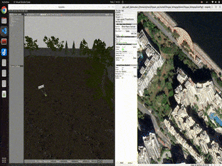
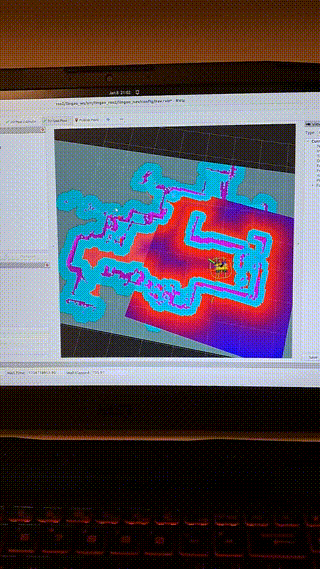
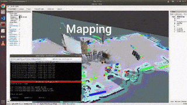
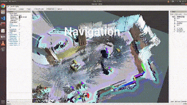

# :robot: Lingao robot ROS2

The vision is to have a robot going up and down the beach. By covering some area it should filter out dirt from the sand and clean up the beach like a vacuum cleaning robot. I tested some methods for SLAM and navigation on the real robot in my living room. The coverage planner and GPS navigation is already implemented in the simulation. However this project is still in progress.

<!-- more -->
## Nav2

## Rtabmap mapping

## Rtabmap navigation

:link: Link to the [Github project](https://github.com/JosefGst/lingao_ros2) .
