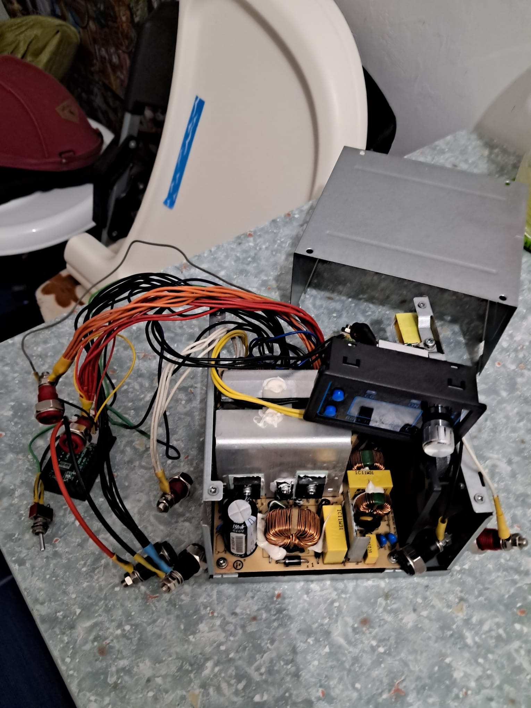

# :electric_plug: Power Supply

{ width="250" }{ width="250" }{ width="250" }

I was lucky enough to find a functional computer power supply in the electric waste of the Uni campus. There are many good tutorials on YouTube how to convert it into a bench power supply. Links to the tutorials are on the lift side. It proved to be a very useful tool for charging batteries and powering prototypes. The front panel is 3D printed and I used Fusion360 for the design.

