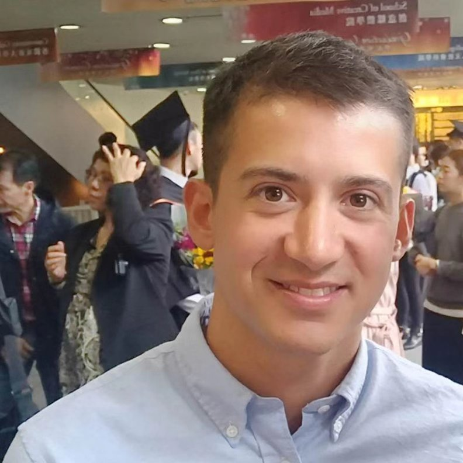

# :rocket: Portfolio Josef Gstoettner

{ width="200" }

Welcome to my portfolio! I'm Josef, a curious tinkerer and hands-on experimenter in robotics, electronics, and software. I use ROS to make real robots sense the world and move autonomously, but also utilize a lot of simulation. Here, you'll find a collection of my hobby projects in different engineering domains and my professional work. Enjoy browsing!

* [Blog](blog/index.md)
* [Portfolio](portfolio/index.md)

## :hammer_and_wrench: A few technologies I've been using recently:

* ROS / ROS 2
* C++ / Python
* Docker
* Fusion 360
* Arduino

## [:page_facing_up: Resume](https://github.com/JosefGst/resume/blob/main/hipster-cv/resume_Gstoettner_J_2026.pdf)
