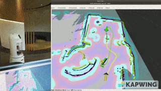
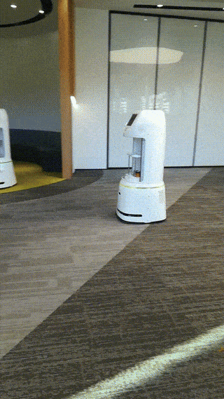
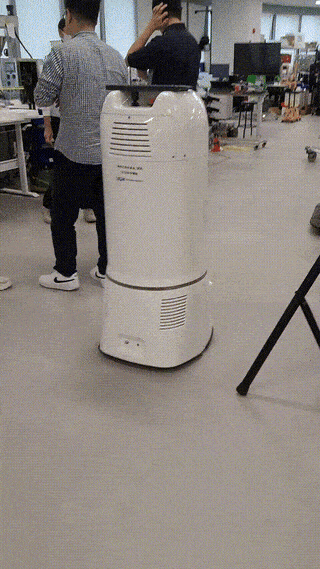
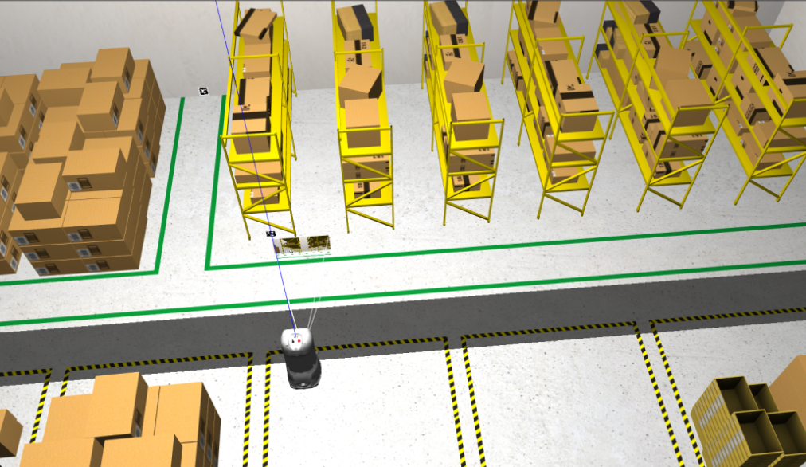

# 🤖 Delivery Robot: Collaborative Autonomy

Delivering goods in busy, obstacle-filled environments like airports is a true test of robotics. This project focused on building a delivery robot system that not only navigates complex spaces, but also coordinates with other robots to avoid collisions and maximize efficiency.

<!-- more -->

## 🛠️ Technology Stack used

- 🤖 [ROS/ROS2](https://wiki.ros.org/noetic) (Robot Operating System)
- 💻 C++, Python
- 🗺️ [SLAM, Navigation Stack](https://wiki.ros.org/navigation)
- ⚙️ [ros_control](https://wiki.ros.org/ros_control)
- 🧪 [Gazebo Simulation](https://gazebosim.org/docs/all/getstarted/)

## ⚡ The Challenge

The airport and similar environments posed unique challenges:

- 🗺️ **Multiple Robots kept kissing each other:** Everything worked fine as soon as you just add one more robot into the same operational field. In ROS navigation, each obstacle is treated as static, but people and robots move. That causes them to collide with each other.

- 👀 **Advanced Obstacle Detection:** The delivery robot was equipped with additional depth cameras to detect barrier bands and avoid common obstacles found in airports. The environment was challenging, with frequent blockages and unpredictable obstacles.

## 🙋 My Contributions

- 🗺️ **Costmap Layer Development:** Created a custom costmap layer in ROS for multi-robot awareness and dynamic collision avoidance. Each robot dynamically created a prohibited area in front of itself, preventing others from entering and reducing the risk of collisions with moving robots. [Jump to costmap layer GIF](#delivery-robot-gif)
- 👀 **Sensor Integration and Navigation tuning:** Integrated depth cameras for robust detection of barrier bands and common airport obstacles. Also ported the whole outdated ROS source code to ROS2 and tuned [MPPI](https://docs.nav2.org/configuration/packages/configuring-mppic.html) controller for improved obstacle avoidance in crowded challenging areas.

  

## 📚 Lessons Learned

- 💡 Shared situational awareness between robots dramatically reduces collisions.
- 👁️ Depth sensing is essential for obstacle detection which can't be detected by 2D Lidars.
- 🔄 Robot development is hard. How do you know your code works? That's why I always develop in simulation first. Here the Hardware is perfect, if something fails it's for sure my code.
  
