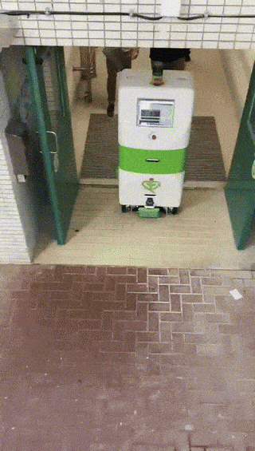
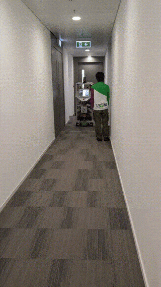
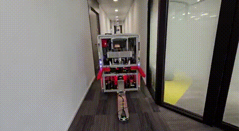
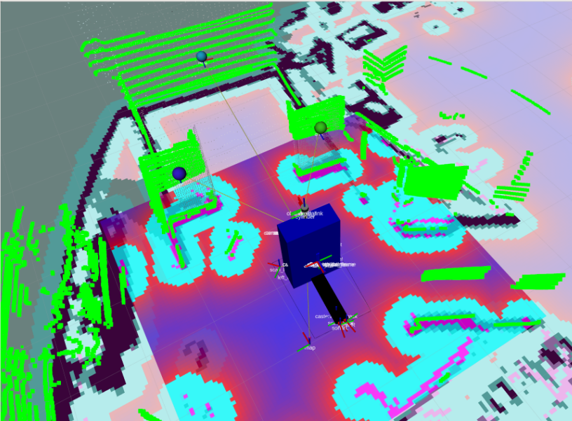
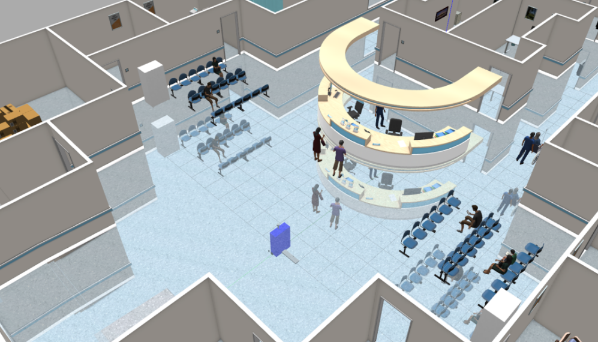

# :hospital: TKO Hospital Laundry Robot:: Engineering Autonomy in Real-World Chaos

Delivering laundry in a hospital might sound simple—until you try to automate it. At the Hong Kong Logistics and Supply Chain MultiTech R&D Centre (LSCM), I worked on an autonomous robot designed to transport laundry from hospital wards to the basement laundry room. The project was a deep dive into the realities of robotics in complex, human-centric environments.

<!-- more -->

## Technology Stack used

- [ROS](https://wiki.ros.org/noetic) (Robot Operating System)
- C++, Python
- [SLAM, Navigation Stack](https://wiki.ros.org/navigation)
- [ros_control](https://wiki.ros.org/ros_control)
- [Gazebo Simulation](https://gazebosim.org/docs/all/getstarted/)

## The Challenge

The hospital posed a unique set of obstacles:

- **Taking the lift:** The robot robot called the lift through the main server who was connected to the hospital's lift PLC controller. Lifts are narrow and often full of people. In such a crowded and narrow space, safe and precise parking was crucial.
- **Narrow, busy corridors:** Hospital hallways are crowded with people, trolleys, and equipment. The robot’s large footprint made navigation especially tricky. Additionally, the robot should not move in the middle of the hallway to avoid blocking the way for people or patient beds.

- **Size and maneuverability:** The robot was big and clunky, making tight turns and precise docking a constant challenge. Specially the lift lobby area where the robot needed to make a 90-degree turn into a narrow space and wait in front of the lift door.
- **Inclines and ramps:** The hospital had one inclined ramp that the robot needed to navigate safely, requiring careful control of speed and traction. The 2D Lidar would sense the incline and think it hit a wall. Also when moving on the ramp, suddenly all the lidar data and point cloud did not match exactly with the map. Localization showed to be not easy to tune for such a scenario.
- **Doors**: The robot was equipped with an bluetooth module which was sensed by the modified automatic doors and would open automatically when the robot approached. However, sometimes the doors would not open due obstacles hindered the swing of the door.
- **Robot Folding**: Since space is very limited in Hong Kong, the robot should fold itself when docked to the charging station to minimize the space it occupied.

## My Contributions

- **SLAM and Navigation:** I set (SLAM) and tuned the navigation until the robot could navigate in very narrow hallways, moved close to the wall without getting stuck or colliding.

- **Sensor and PCB Integration:** I integrated a suite of sensors, including LIDAR, depth cameras, IMU and communication to a custom PCB into the ROS ecosystem, ensuring reliable perception and robust data flow.
- **Motor Driver Development:** Developed the motor driver interface via RS485 using ros_control and tuned the PID for smooth movement.
- **Door detection**: Using Lidar data, I implemented a door detection algorithm that allowed the robot to identify whether the doors were really open or not. This was also an important safety feature when entering the lift, since it was not clear when the lift actually arrived and opened the door.

- **Docking Algorithm:** I designed the docking algorithm that lets the robot autonomously find and connect to its charging station. With april tags which can be precisely detected by cheap rgb cameras, the robot then would use a simple carrot controller to approach the charging station.

## Lessons Learned

- Public places like hospitals are dynamic and chaotic environments, very challenging for autonomous robots. Next I want to explore the use of behavior trees to create recovery behaviors to make the operation more robust.
- Autonomous elevator use is a surprisingly hard robotics problem, requiring careful timing and system integration.
- Testing on site is difficult and time-consuming. Simulations can help, but they can never fully capture the complexity of the real world. I want to explore more on sim-to-real transfer techniques to speed up development. 
