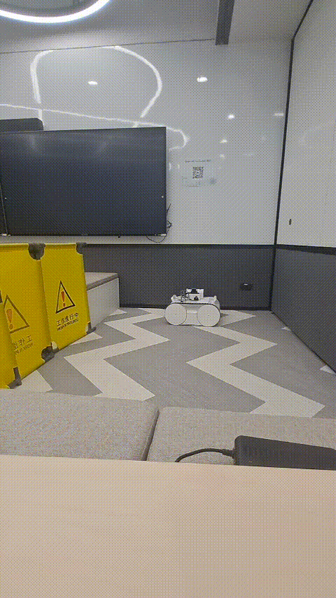
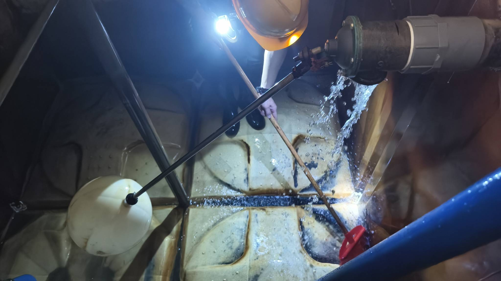
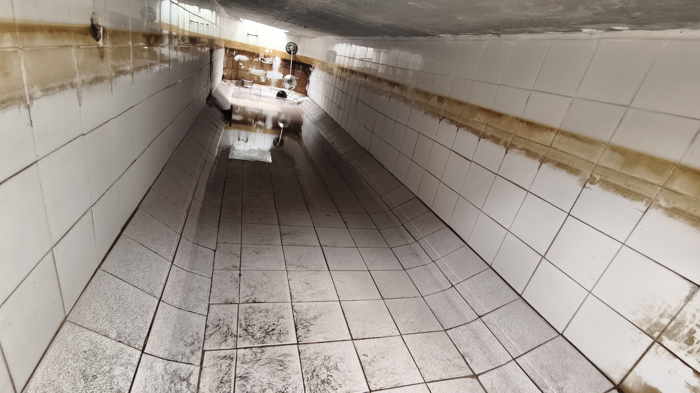
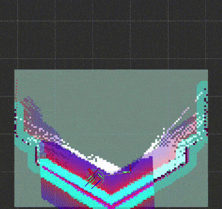
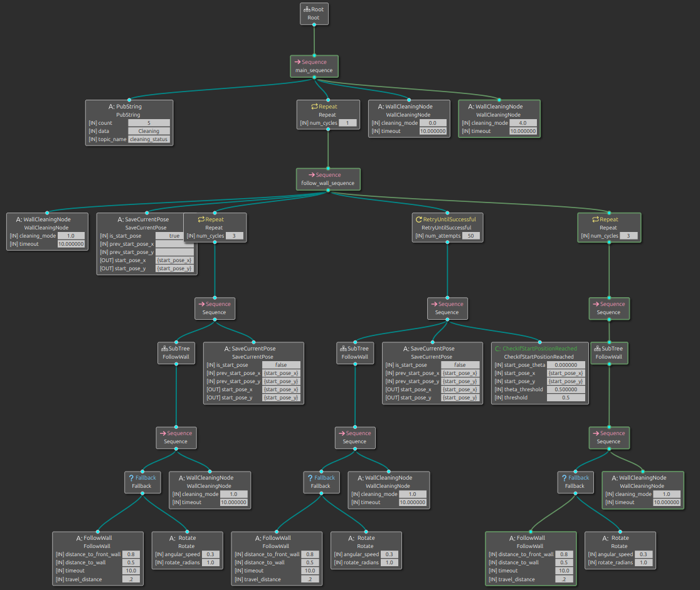
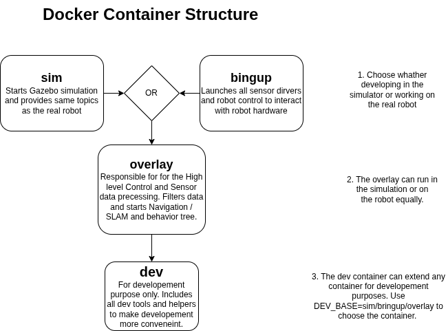
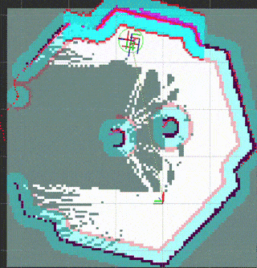

# :sweat_drops: Water Tank Cleaning Robot | HKCRC

## 🛠️ Technology Stack
- [ROS2](https://docs.ros.org/en/jazzy/index.html)
- C++, Python, Docker
- [SLAM, Nav2](https://docs.nav2.org/index.html)
- [Gazebo Simulation](https://gazebosim.org/docs/all/getstarted/)
- [Behavior_tree_cpp](https://www.behaviortree.dev/)

<!-- more -->

## ❓ Problem Statement

Potable water tanks require regular cleaning to ensure water quality and safety. Traditional cleaning methods are labor-intensive, time-consuming, and pose health risks to workers due to exposure to contaminants.

<!--  -->

## 💡 Proposed Solution
To address this, we are developing an autonomous cleaning robot using a high-pressure water jet mounted on the robot to clean the tank surfaces effectively. The robot first follows the wall and cleans the wall surfaces while mapping the environment. After that, it performs coverage path planning to ensure all areas of the floor and ceiling are cleaned as well.

>TODO: Demo video coming soon: see the robot cleaning inside a real water tank

## 🤖 My Contributions
  1. 🗺️ When I started, the robot was very difficult to maneuver—the minimum velocity was too high, and the control was buggy. Both the mechanical structure and control software were still under construction. After setting up a simple Gazebo simulation, I was able to accelerate the development of the higher-level control systems.
  2. 🧹 I dove into ROS2’s navigation stack, wrestling with SLAM until the robot could finally map its surroundings. I further added opennav_coverage. All of this works very well together since they are the most popular stack for these tasks and the setup was straightforward.
    
  3. 🌳 To continue, I created a wall-following task using behavior trees, which serves two purposes. First, the robot uses the water jet to clean the wall. Secondly, at the same time, it maps the environment. [Behavior_tree_cpp](https://www.behaviortree.dev/) is the most popular library for this and is also used internally in [Nav2](https://docs.nav2.org/index.html). Tasks can be split into their smallest entities and later combined to fulfill complex tasks and recover from failures.
    
  4. 🐳 The first version of the robot used the Raspberry Pi 5. For the second version, it was upgraded to the Jetson Orin Nano because the computer vision needed higher performance. Thanks to that upgrade, suddenly the whole ROS workspace could not be installed anymore because on the Pi the Ubuntu version was 24.04, but on Jetson you have to install Jetpack, which is equivalent to Ubuntu 22.04. Docker saved the day and helped me dodge dependency hell by creating a modular Docker environment. It streamlined the development process for both simulation and real robot deployment, utilizing a development container that can attach to any other container. It includes all dev tools and keeps the deployable image small and clean.
    
  5. After everything worked fine, it was time to challenge the robot—testing in very narrow environments, very large ones, or by adding unmapped obstacles. The coverage planner seemed promising, but it failed spectacularly with obstacle avoidance. The open nav2 coverage planner is based on fields2cover and it works very well to create paths that cover the whole area. Although you can define obstacles in the map, the planner will [not consider holes when path planning #50](https://github.com/open-navigation/opennav_coverage/issues/50). Dynamic obstacle avoidance is also not working; see Issue 👉 [Skip waypoints if occupied #68](https://github.com/open-navigation/opennav_coverage/issues/68). This was a huge setback, since I thought this would work out of the box.
  6. 🤯 I was surprised when obstacle avoidance didn’t work out of the box. After some head-scratching and research, we had to build our own planner. It takes the map image and uses computer vision to create goal poses in a swath pattern style, which can be used by the DWB planner. By following the goal poses, the robot's global planner can replan when the robot gets stuck, and the local planner will avoid unmapped obstacles. It’s not perfect yet—when avoiding obstacles, some areas aren’t covered, but it’s progress.
    

## 🏆 Lessons Learned

Building this robot was a crash course in both robotics and humility. I quickly learned that even the most popular tools—like ROS2’s navigation stack and coverage planners—don’t always work as expected. Wrestling with Docker to tame dependency chaos was frustrating at first, but ultimately empowering; it turned what could have been weeks of setup headaches into a streamlined workflow. The biggest surprise was how much behavior trees simplified complex task orchestration, letting me recover from failures and tweak behaviors on the fly. Every setback, from hardware upgrades to planner limitations, forced me to dig deeper and get creative. Next I plan to improve the coverage planner and integrate it into the behavior tree for a fully autonomous cleaning cycle and better robustness.
