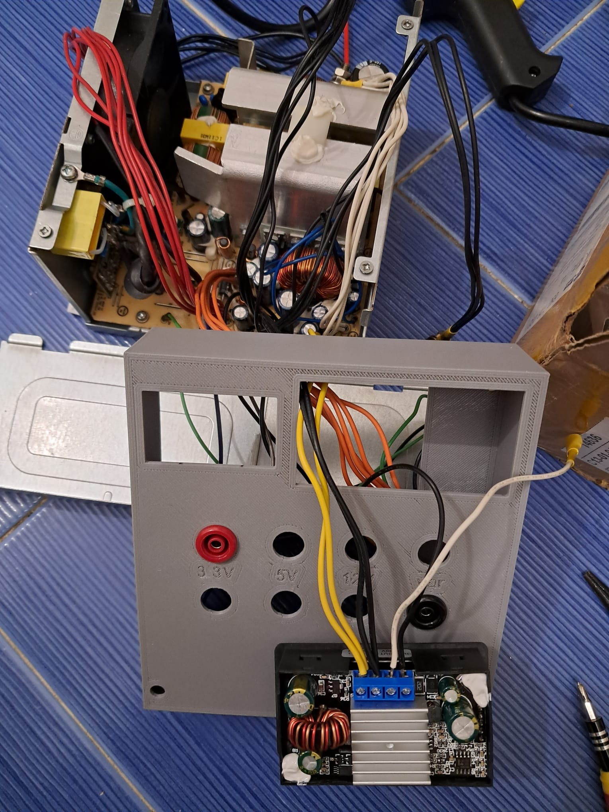

# :heart: Projects
A collection of my side projects. Reaching 100% completion is almost impossible for me. But partially finished is good enough for this :memo: list.
## :robot: [Lingao robot ROS2](https://github.com/JosefGst/lingao_ros2)
February 2024

A wannabe beach cleaning Robot. The goal is to use the coverage planner to drive up a specified area and filter big particles out of the sand, like a vacuum cleaning robot but on the beach.

## :electric_plug: Power Supply
January 2024

{ width="250" }{ width="250" }{ width="250" }

I was lucky enough to find a functional computer power supply in the electric waste of the Uni campus. There are many good tutorials on YouTube how to convert it into a bench power supply. Links to the tutorials are below. It proved to be a very useful tool for charging batteries and powering prototypes. The front panel is 3D printed and I used Fusion360 for the design.

### Resources

[DroneBot Workshop](https://www.youtube.com/watch?v=n_A-jkpjpcM)

[GreatScott!](https://www.youtube.com/watch?v=oeNAhP-GIjo)